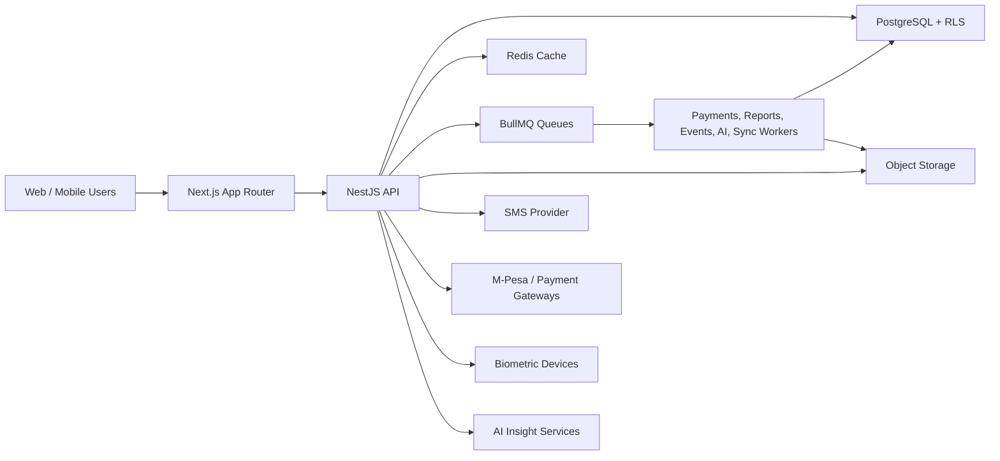
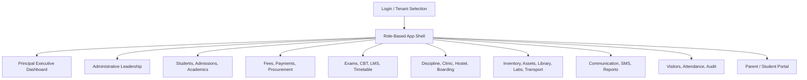
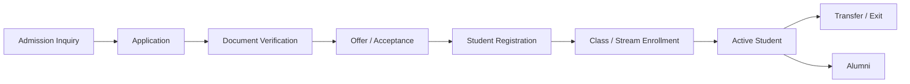
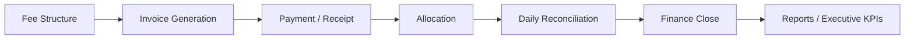
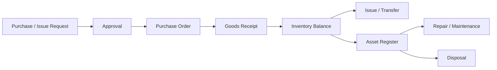

# Implementation 100 Production-Ready School ERP Module Upgrade Blueprint

> **For agentic workers:** REQUIRED SUB-SKILL: Use `superpowers:subagent-driven-development` or `superpowers:executing-plans` when executing this blueprint task-by-task. Use `codex-security:security-scan` before implementing security-sensitive flows, payments, health records, child data, biometric attendance, AI recommendations, and visitor/security controls.

**Goal:** Upgrade every school ERP module into a fully operational, production-ready, user-friendly, secure, auditable, and visually consistent system for modern Kenyan and international schools. No module may ship as a half-working model, mock-only surface, disconnected UI, or partial backend.

**Architecture:** Keep the current monorepo direction: Next.js App Router web frontend, NestJS API, PostgreSQL with tenant isolation, Redis/BullMQ background jobs, report/export workers, object storage for documents, SMS and payment integrations, biometric/offline sync adapters, and release gates for security, performance, accessibility, and module completeness.

**Tech Stack:** Next.js, React, TypeScript, TailwindCSS design tokens, NestJS, PostgreSQL, Redis, BullMQ, object storage, PDF/CSV/Excel export workers, Playwright/design tests, Jest/Node tests, tenant-aware RBAC/ABAC, audit logs, outbox events, and production certification scripts.

**Theme Mandate:** The entire system must use a consistent institutional theme:

| Token | Usage | Hex |
| --- | --- | --- |
| Dark Navy Blue | Headers, sidebar, topbar, primary buttons, high-emphasis panels | `#071D49` to `#0B234F` |
| Orange Accent | CTA buttons, highlights, active states, urgent-but-not-danger emphasis | `#FF7A1A` |
| Light Gray / Off White | App background, section bands, neutral table surfaces | `#F3F4F6` |
| Dark Text Blue | Headings, body text, table labels | `#0F2345` |
| White | Content surfaces, forms, tables, cards | `#FFFFFF` |
| Success Green | Positive states only | `#059669` |
| Warning Amber | Warnings that are not primary CTAs | `#F59E0B` |
| Danger Red | Destructive, medical emergency, breach, and safety states | `#DC2626` |

**Implementation Status:** Planning blueprint created. This file is the single source of truth for the Implementation 100 upgrade scope.

**Operational Completeness Mandate:** Every module listed in this blueprint must be complete enough to run real school operations end to end. A module is not considered delivered until its frontend, backend, database schema, permissions, validations, reports, audit logs, tests, observability, and user documentation are all connected and verified with realistic data.

---

## 1. Product Requirements Document

### 1.1 Product Vision

Build a school operating system where leaders, staff, parents, and students can complete real daily work without confusion, duplicate records, manual reconciliation, or scattered reports. The product should feel calm, fast, trustworthy, and institution-grade. Every module must be usable by non-technical school staff on low-bandwidth devices, while still giving leadership strong analytics and accountability.

### 1.2 Primary Users

| User | Primary Jobs |
| --- | --- |
| Principal | Monitor school health, approve escalations, review executive KPIs, act on alerts, export reports. |
| Deputy Principal | Manage discipline, academics, timetable coverage, boarding, teacher punctuality, and daily operations. |
| Secretary / Registrar | Handle admissions, student records, guardians, transfers, documents, and visitor appointments. |
| Bursar / Accountant | Configure fees, invoice learners, reconcile payments, track arrears, issue receipts, export finance reports. |
| Teacher | Take attendance where applicable, enter marks, view timetables, upload assignments, communicate class updates. |
| Head of Department | Monitor subject coverage, lab sessions, assessments, resources, and academic quality. |
| Librarian | Manage catalog, lending, returns, fines, reservations, borrower limits, and stock reports. |
| Lab Technician | Manage labs, equipment, chemicals, attendance, safety logs, and disposal requests. |
| Nurse / Clinic Officer | Record clinic visits, dispense medicine, track stock, review health history, notify parents. |
| Storekeeper | Manage stock receipts, issuing, transfers, counts, valuation, and reconciliation. |
| Procurement Officer | Process requests, suppliers, purchase orders, approvals, invoices, and budget linkage. |
| HR Officer | Manage staff profiles, contracts, leave, payroll summaries, documents, and duty ownership. |
| Transport Manager | Manage routes, vehicles, learner manifests, trips, incidents, and route alerts. |
| Boarding / Hostel Master | Manage houses, dormitories, occupancy, meals, issues, incidents, and boarder welfare. |
| Parent / Guardian | View child summaries, results, fees, attendance, messages, health notes, and make payments. |
| Student | Access learning resources, assignments, results, timetable, library status, and CBT exams. |
| Gate Security | Log visitors, appointments, check-ins, emergencies, passes, and security reports. |
| Platform Superadmin | Configure tenants, modules, packages, billing, security settings, support, and operational monitoring. |

### 1.3 Product Principles

- Every module must answer: what needs attention, what changed recently, what action can the user take now.
- Every record must have ownership, status, history, and auditability.
- Parent-facing data must be clear, limited, consent-aware, and safe for minors.
- Money-moving flows must be idempotent, reconciled, and exportable.
- Health, discipline, counselling, biometrics, and child data must use strict access controls and redaction.
- Each module must work in a consistent shell with the same navigation, filtering, empty states, loading states, and export behavior.
- Dashboards must show decision-grade KPIs, not decorative charts.
- Mobile screens must support the most common workflows, not only read-only summaries.
- No module may be marked ready if it depends on static mock data, placeholder actions, fake counts, disabled primary workflows, missing persistence, missing reports, or unverified API routes.
- Production readiness means a school can use the module for the full workflow during a real school day and recover cleanly from mistakes, failed integrations, offline sync delays, and permission errors.

### 1.4 Success Metrics

| Area | Target |
| --- | --- |
| Task completion | 90% of core workflows complete without training after first guided session. |
| Performance | p95 API read under 700 ms, p95 write accepted under 1,200 ms, dashboard first content under 2.5 s on common mobile networks. |
| Reliability | 99.9% availability for school-day critical flows. |
| Data integrity | Zero unreconciled money flows after daily close; no orphaned student lifecycle records. |
| Security | Tenant isolation, RBAC, ABAC, audit logs, PII redaction, and export controls pass release gates. |
| Accessibility | Keyboard navigation, focus states, contrast, labels, and table usability pass design tests. |
| Adoption | 80% of active staff use at least one workflow weekly; 60% of parents activate portal in pilot schools. |
| Support | Fewer than 5 high-severity support tickets per pilot school after first month. |

### 1.5 Module Product Scope

| Module | Production-Ready Scope | Required KPIs / Alerts |
| --- | --- | --- |
| Student Management | Student records, profiles, guardians, enrollment history, status lifecycle, documents, medical flags, sibling links, transfers, alumni records. | Active learners, incomplete profiles, missing guardians, transfer requests, inactive records, document gaps. |
| Admissions | Application intake, onboarding, document verification, interviews, offers, transfer-in/out, registration, admission fee handoff. | Pending applications, verified documents, conversion rate, overdue reviews, rejected reasons, transfer volume. |
| Academic Structure | CBE, CBC, 8-4-4, international levels, academic years, terms, classes, streams, subjects, teacher assignments, learner placements. | Class occupancy, subject coverage, unassigned subjects, curriculum mix, teacher load. |
| Fee Management | Fee structures, invoices, waivers, scholarships, manual payments, M-Pesa payments, receipts, allocations, arrears, refunds, daily close. | Collections, arrears, allocation exceptions, failed callbacks, unreconciled payments, revenue by stream. |
| Exams and Results | Assessment plans, mark sheets, grading, moderation, report cards, result publishing, analytics, CBT hooks. | Missing marks, performance trends, grade distribution, publish readiness, ranking policy compliance. |
| Discipline | Incidents, actions, escalation, counselling referrals, welfare notes, parent acknowledgements, behavior analytics. | Open incidents, repeat cases, severe incidents, overdue actions, counselling follow-ups. |
| Timetable | Published timetables, lesson coverage, room planning, substitution, conflicts, teacher workload, learner schedules. | Conflicts, uncovered lessons, room clashes, teacher overload, coverage percentage. |
| Laboratory Management | Labs, sessions, mandatory attendance, equipment, chemical inventory, safety controls, disposal, incidents. | Session attendance, low stock chemicals, expired chemicals, safety incidents, equipment downtime. |
| Teacher Attendance | Biometric scans, attendance logs, late arrivals, absences, offline device sync, punctuality reports. | Daily punctuality, missing scans, device sync lag, absenteeism, approval exceptions. |
| Parent Portal | Parent and student self-service, child summaries, fees, payments, messages, results, attendance, health notices. | Portal activations, payment conversion, unread messages, parent engagement, failed OTPs. |
| Store and Inventory | Stock, procurement intake, issuing, transfers, assets, valuation, counts, reconciliation, damaged/lost items. | Low stock, stock value, unapproved issues, count variances, aging stock. |
| Library | Catalog, copies, borrowers, lending, returns, renewals, fines, reservations, scan workflows, reports. | Overdue items, active loans, fines, popular books, missing copies, reservation queue. |
| Transport | Routes, vehicles, drivers, learner manifests, trips, route alerts, incidents, fuel/service logs. | Learners by route, missed trips, vehicle availability, incidents, route capacity. |
| Communication and SMS | SMS wallet, templates, announcements, reminders, delivery logs, opt-outs, parent engagement analytics. | Wallet balance, delivery rate, failed messages, unread critical notices, engagement rate. |
| Reports | PDF, CSV, Excel, scheduled reports, graphical dashboards, operational exports, report snapshots. | Scheduled report success, export queue lag, failed exports, top reports. |
| Staff and HR | Staff profiles, contracts, documents, leave, attendance summaries, duty ownership, payroll summaries. | Staff headcount, leave balances, expiring contracts, missing documents, payroll exceptions. |
| Administrative Leadership | Principal, deputy principal, and secretary command centers with workload queues and approvals. | Pending approvals, unresolved incidents, admissions backlog, daily operational risk. |
| Principal Executive Dashboard | Module-aware executive KPIs, alerts, analytics, trends, recommendations, downloadable packs. | School health score, finance trend, academic trend, welfare risk, operational exceptions. |
| Clinic and Health | Clinic visits, medicine inventory, dispensing, parent medical history, referrals, allergies, stock control. | Clinic visits, low medicine stock, expired medicine, repeat visits, parent notifications. |
| Procurement | Purchase requests, supplier tracking, approvals, purchase orders, invoice attachments, budget linkage. | Pending approvals, supplier performance, budget variance, outstanding invoices. |
| Hostel | Hostel occupancy, dormitory issues, boarding incidents, allocations, bed inventory, maintenance. | Occupancy, open issues, incidents, bed availability, maintenance backlog. |
| Boarding Management | Boarding houses, meal analytics, dormitory oversight, boarding operations, roll calls, welfare. | Meal consumption, roll-call exceptions, boarder count, welfare flags, house trends. |
| CBT Exams | Online exams, question banks, invigilation analytics, attempts, grading, proctoring flags. | Active exams, completion rate, suspicious activity, auto-grade status, connectivity failures. |
| eLearning and LMS | Digital content, assignments, submissions, learner activity, online class resources, teacher feedback. | Assignment completion, resource views, inactive learners, late submissions, content coverage. |
| AI Insights | Auditable smart alerts, forecasts, anomalies, recommendations, explainability, human review. | Accepted alerts, dismissed alerts, anomaly accuracy, forecast drift, high-risk recommendations. |
| Visitor Management | Gate visitors, appointments, check-ins, badges, emergency logs, blacklists, security reports. | Visitors on site, overdue check-outs, denied entries, emergency events, appointment compliance. |
| Asset Tracking | Asset register, assignment, repairs, depreciation, utilization, disposal, insurance, reports. | Asset value, repairs due, utilization, depreciation, unassigned assets, disposal queue. |

---

## 2. Technical Requirements Document

### 2.1 System Architecture



### 2.2 Module Service Standard

Every backend module must expose the same production structure:

- `*.module.ts` registers controllers, services, repositories, schema bootstrap, and event publishers.
- `*.controller.ts` exposes tenant-bound REST endpoints with DTO validation.
- `*.service.ts` owns workflow rules, permissions, status transitions, idempotency, and events.
- `repositories/*.repository.ts` owns SQL, transactions, row locking, pagination, and query projection.
- `dto/*.dto.ts` defines request/response validation and redaction-friendly shapes.
- `*-schema.service.ts` owns additive schema bootstrap or migration SQL until formal migrations take over.
- `*.test.ts` covers schema creation, permission gates, status transitions, idempotency, and edge cases.
- `module-certification` entries prove UX, API, security, reporting, and performance readiness.

### 2.3 Fully Operational Module Standard

Each module must pass this completeness contract before it is exposed to production tenants:

- Real data persistence exists for every primary workflow, with migrations or schema bootstrap, indexes, and relational integrity.
- Frontend screens call live APIs through typed client adapters; no production screen uses static fixtures except empty-state examples and test-only fixtures.
- Create, read, update, close/archive, approve/reject, publish, export, and notify actions exist where the module workflow requires them.
- All primary actions have server-side validation, permission checks, audit logs, and user-visible success/failure feedback.
- Each module has realistic seed data for demos and tests, but demo data is clearly separated from production data paths.
- Each module has at least one role-specific dashboard or workspace, one detail/profile view, one list view, and one report/export surface where applicable.
- Cross-module handoffs work through real events or service calls, for example admissions to students, invoices to payments, procurement to inventory, clinic stock to procurement, and results to parent portal.
- Background jobs are implemented for slow work such as report generation, SMS delivery, AI analysis, payment verification, sync processing, and large exports.
- Module certification fails if core routes return placeholder content, actions are disabled without a permission reason, data does not persist after refresh, or reports cannot be generated.

### 2.4 API Standards

- Use REST resources grouped by module, for example `/students`, `/admissions/applications`, `/finance/invoices`, `/library/borrowings`.
- All tenant-scoped requests must derive `tenant_id` from authenticated membership, never from an untrusted header.
- All writes must accept an `Idempotency-Key` for payments, admissions, attendance sync, inventory movement, marks publishing, and document uploads.
- All list endpoints must support cursor pagination, search, filters, sort, and export handoff.
- All responses must include stable IDs, status, timestamps, and user-action metadata where useful.
- Dangerous actions must require explicit confirmation, permission checks, audit logs, and undo/compensating workflow when possible.
- Parent portal APIs must return only the parent's authorized learners and redacted child-safe fields.

### 2.5 Security and Compliance Requirements

- Enforce RBAC for role access and ABAC for record-level constraints such as class ownership, department, house, child relationship, and finance role.
- Maintain PostgreSQL tenant isolation with RLS or equivalent enforced tenant predicates.
- Encrypt or strongly protect high-risk fields: counselling notes, medical notes, biometric identifiers, payment credentials, and AI training/evaluation payloads.
- Redact PII in logs, support tickets, report previews, and AI prompts.
- Record audit logs for create, update, delete, approve, reject, publish, export, login, payment, health, discipline, visitor, and biometric events.
- Require MFA or step-up confirmation for superadmin, finance close, payroll summaries, payment credentials, health exports, and bulk student exports.
- Enforce data retention policies for child data, visitor logs, biometric events, health data, and communications.
- Add emergency lockdown mode for suspected breach, visitor incident, or payment fraud.

### 2.6 Data Integrity Requirements

- Use database transactions for lifecycle transitions, invoices/payments, inventory movements, library circulation, medicine dispensing, procurement approvals, and asset disposal.
- Use append-only ledgers where reversal history matters: finance ledger, inventory movements, library circulation, clinic stock, asset repairs, SMS wallet, and audit logs.
- Prevent duplicate learners by normalized names, admission number, birth certificate/passport ID where available, date of birth, guardian phone, and tenant-specific matching.
- Require daily finance close checks: ledger balance, M-Pesa reconciliation, manual receipt review, allocation exceptions, refund queue.
- Require publish gates for report cards, timetables, announcements, CBT exams, and portal-visible health notices.

### 2.7 Offline and Device Sync

- Biometric devices, mobile attendance, gate visitor devices, and low-connectivity field operations must queue local events.
- Sync payloads must include device ID, event ID, occurred-at timestamp, actor, checksum, and idempotency key.
- Conflict policies must be explicit: newest status does not automatically win where money, attendance, health, or safety is involved.
- Device sync dashboards must show lag, failed events, duplicate drops, and manual review queues.

### 2.8 Reporting and Export

- Reports must run through report jobs for heavy PDF/Excel generation.
- Every export must record actor, filters, row count, data classification, and artifact retention.
- Sensitive exports must be watermarked and expire.
- Scheduled reports must support recipients, cadence, delivery status, failure retries, and audit logs.
- Executive reports must be module-aware and explain data freshness.

### 2.9 Observability and Operations

- Each module must emit metrics for request latency, error rate, queue lag, slow queries, export failures, and critical workflow counts.
- Add dashboards for school-day operations: finance, admissions, attendance, exams publishing, SMS delivery, parent portal, biometric sync, and security gate.
- Add synthetic journeys for login, student lookup, fee payment, report card publishing, parent portal view, library issue/return, and visitor check-in.
- Add alerts for money-flow failure, tenant isolation violation, export queue backlog, low SMS wallet, device sync outage, health/visitor emergencies, and AI anomaly drift.

### 2.10 Performance Budgets

| Surface | Target |
| --- | --- |
| Dashboard initial summary | p95 under 700 ms API, cached where safe. |
| Student search | p95 under 500 ms with indexed search. |
| Finance balance lookup | p95 under 650 ms with ledger snapshot support. |
| Mark entry save | p95 under 1,200 ms. |
| Payment callback acknowledgement | p95 under 300 ms, async verification allowed. |
| Report export enqueue | p95 under 300 ms. |
| Parent portal child summary | p95 under 700 ms. |
| Biometric sync batch acceptance | p95 under 1,200 ms for normal batches. |

---

## 3. App Flow Document

### 3.1 Global Information Architecture



### 3.2 Login and Routing Flow

1. User selects experience: school staff, parent, student, platform admin, support.
2. System authenticates with MFA/OTP where required.
3. Tenant context and role membership are resolved server-side.
4. Module access is loaded from `module_registry` and `school_module_access`.
5. User lands on the most relevant dashboard:
   - Principal: executive dashboard.
   - Deputy: operational command center.
   - Secretary: admissions and student records queue.
   - Accountant: finance dashboard.
   - Teacher: timetable, marks, assignments, and assigned learners.
   - Parent: child summary.
   - Gate security: visitor check-in queue.
6. App shell shows only allowed modules and allowed actions.

### 3.3 Student Lifecycle Flow



Production rules:

- A student cannot be active without at least one guardian, class placement, admission number, and required profile fields.
- Transfers preserve historical enrollment, fees, results, library, discipline, health, and boarding records.
- Parent portal access is linked only after guardian verification.

### 3.4 Finance Flow



Production rules:

- All payments produce immutable receipt records.
- Manual payments require role approval and receipt attachment where configured.
- M-Pesa callbacks are acknowledged quickly, verified asynchronously, and matched to invoices or suspense.
- Arrears must use current ledger balance, not stale invoice totals.

### 3.5 Academic and Assessment Flow

1. Academic year and term are configured.
2. Levels, classes, streams, subjects, and teacher assignments are created.
3. Assessment plans define exams, grading scales, competencies, and publish policy.
4. Teachers enter marks or CBT results sync in.
5. Department or exams office moderates marks.
6. Principal or authorized role approves publishing.
7. Parent/student portal receives published results only.

### 3.6 Discipline, Counselling, and Welfare Flow

1. Incident is logged by authorized staff.
2. Severity and category determine routing.
3. Actions, parent acknowledgement, counselling referral, or escalation are created.
4. Sensitive notes are restricted to welfare/counselling roles.
5. Deputy or principal reviews repeated or severe cases.
6. Analytics show patterns without exposing private counselling text.

### 3.7 Procurement, Inventory, and Asset Flow



Production rules:

- Stock and asset movements must be ledger-based.
- Procurement approvals must respect budgets and role thresholds.
- Inventory, procurement, assets, labs, clinic, and boarding meals must share item references where practical.

### 3.8 Parent Portal Flow

1. Parent verifies phone/email through OTP.
2. System resolves linked learners.
3. Parent chooses a child.
4. Portal shows summary tabs: fees, results, attendance, messages, health notices, library, transport, boarding where enabled.
5. Parent can pay fees, acknowledge discipline notices, read announcements, download allowed reports, and update contact information through approval.

### 3.9 Visitor and Emergency Flow

1. Gate staff checks appointment or creates walk-in record.
2. Visitor ID, host, purpose, badge, and check-in time are recorded.
3. Host receives notification.
4. Visitor is checked out or escalated if overdue.
5. Emergency mode exposes current visitors, boarders, clinic cases, transport trips, and key contacts to authorized leadership.

---

## 4. UI / UX Design System

### 4.1 Theme Tokens

The current global design tokens should be migrated to this system-wide palette:

```css
:root {
  --background: #f3f4f6;
  --foreground: #0f2345;
  --surface: #ffffff;
  --surface-muted: #f8fafc;
  --surface-strong: #e5e7eb;

  --primary: #071d49;
  --primary-hover: #0b234f;
  --primary-soft: rgba(7, 29, 73, 0.08);
  --primary-muted: rgba(7, 29, 73, 0.14);

  --accent: #ff7a1a;
  --accent-hover: #e8660d;
  --accent-soft: rgba(255, 122, 26, 0.12);
  --accent-muted: rgba(255, 122, 26, 0.2);

  --border: #d9dee8;
  --border-strong: #b9c2d3;
  --muted: #5d6b82;
  --muted-strong: #374761;

  --danger: #dc2626;
  --warning: #f59e0b;
  --success: #059669;
  --info: #2563eb;
}
```

### 4.2 Visual Direction

- Use dark navy topbars, sidebars, section headers, primary buttons, and executive panels.
- Use orange only for primary CTAs, active navigation accents, selected tabs, count badges, and high-value highlights.
- Use off-white backgrounds for the app frame and white surfaces for data-heavy workspaces.
- Use dark text blue for headings and table content.
- Keep operational modules dense, scan-friendly, and calm. Avoid decorative landing-page patterns inside workspaces.
- Cards may be used for repeated entities and dashboard widgets, but page sections should remain unframed layouts.
- Tables must support sticky headers, row actions, bulk actions, empty states, loading skeletons, filter chips, and export buttons.
- Forms must use clear grouping, inline validation, save/cancel consistency, dirty-state warnings, and autosave only where safe.
- Critical actions require clear confirmation and role-aware copy.

### 4.3 App Shell

Required shell areas:

- Navy sidebar with grouped modules and visible active state using orange left border or indicator.
- Navy or white topbar depending on density needs; principal dashboard may use navy executive header.
- Global school/tenant switcher only for users with multi-tenant access.
- Search command palette for students, staff, guardians, invoices, assets, books, and routes.
- Right-side context panel for alerts, approvals, recent activity, and help.
- Breadcrumbs for deep workflows.
- Consistent page header with title, status summary, primary action, secondary actions, and export menu.

### 4.4 Module UX Patterns

| Pattern | Used By | UX Requirement |
| --- | --- | --- |
| Queue workspace | Admissions, discipline, procurement, clinic, support, visitor management | Kanban or status tabs plus filters, owner, due date, next action. |
| Ledger workspace | Finance, inventory, clinic stock, library circulation, assets, SMS wallet | Immutable movement list, balance summary, reversal flow, audit trail. |
| Planner workspace | Timetable, CBT, LMS, exams, transport, boarding meals | Calendar/grid view, conflict detection, publish gate, version history. |
| Profile workspace | Students, staff, guardians, assets, vehicles, books | Summary header, tabs, timeline, documents, related records, redaction. |
| Command center | Principal, deputy, secretary, boarding, transport | KPIs, alerts, approval queue, trend charts, prioritized actions. |
| Portal workspace | Parent and student portal | Child selector, digest cards, payments, messages, results, downloads. |

### 4.5 Accessibility and Responsiveness

- Minimum color contrast must meet WCAG AA for text and controls.
- Every icon-only button must have an accessible label and tooltip.
- All dialogs must trap focus and return focus to the trigger.
- Tables must have mobile alternatives: stacked rows, priority columns, or horizontal scroll with stable controls.
- Touch targets must be at least 44px for mobile-critical actions.
- No text may overflow buttons, cards, navigation labels, or table cells without wrapping/truncation rules.

---

## 5. Backend Schema Blueprint

### 5.1 Shared Table Standards

Every tenant-scoped table should include:

- `id UUID PRIMARY KEY`
- `tenant_id UUID NOT NULL`
- `status TEXT NOT NULL`
- `created_at TIMESTAMPTZ NOT NULL`
- `updated_at TIMESTAMPTZ NOT NULL`
- `created_by_user_id UUID`
- `updated_by_user_id UUID`
- `metadata JSONB NOT NULL DEFAULT '{}'`
- Index on `(tenant_id, status, updated_at DESC)` where status filtering is common.
- Audit events in `audit_logs` for sensitive mutations.

### 5.2 Core Platform and Security Tables

| Table | Purpose |
| --- | --- |
| `tenants` | Schools and platform tenants. |
| `tenant_domains` | Custom school domains and aliases. |
| `users` | Platform user identity. |
| `roles` | Tenant and platform roles. |
| `permissions` | Permission registry. |
| `role_permissions` | Role to permission mapping. |
| `tenant_memberships` | User membership, role, status, and tenant binding. |
| `module_registry` | Canonical module list and feature flags. |
| `school_module_access` | Tenant module enablement and package access. |
| `module_packages` | Commercial or operational module bundles. |
| `module_package_items` | Modules included in packages. |
| `module_usage_events` | Module adoption, billing, and analytics events. |
| `audit_logs` | Immutable action logs. |
| `outbox_events` | Reliable domain events. |
| `idempotency_keys` | Duplicate write protection. |
| `file_objects` | Uploaded document metadata. |
| `approval_requests` | Shared approval workflow records. |
| `notifications` | In-app notifications. |
| `notification_deliveries` | SMS, email, and portal delivery attempts. |
| `data_subject_requests` | Compliance requests. |
| `consent_records` | Parent/user consent history. |

### 5.3 Module Schema Map

| Module | Primary Tables |
| --- | --- |
| Student Management | `students`, `student_guardians`, `guardians`, `student_documents`, `student_medical_flags`, `student_lifecycle_events`, `student_siblings`, `student_notes`, `student_status_history` |
| Admissions | `admission_applications`, `admission_applicants`, `admission_documents`, `admission_reviews`, `admission_interviews`, `admission_offers`, `admission_transfer_records`, `registration_checklists` |
| Academic Structure | `academic_years`, `academic_terms`, `academic_levels`, `curriculum_frameworks`, `class_sections`, `class_streams`, `subjects`, `class_subject_assignments`, `teacher_subject_assignments`, `student_class_assignments` |
| Fee Management | `fee_structures`, `fee_structure_items`, `student_fee_invoices`, `student_fee_invoice_lines`, `manual_fee_payments`, `manual_fee_payment_allocations`, `payment_intents`, `mpesa_transactions`, `mpesa_c2b_payments`, `finance_close_periods`, `accounts`, `transactions`, `ledger_entries` |
| Exams and Results | `assessment_plans`, `assessment_components`, `mark_sheets`, `student_marks`, `grading_scales`, `result_moderations`, `report_cards`, `result_publish_batches`, `academic_analytics_snapshots` |
| Discipline | `offense_categories`, `discipline_incidents`, `discipline_actions`, `discipline_comments`, `discipline_attachments`, `discipline_notifications`, `behavior_points`, `commendations`, `parent_acknowledgements`, `counselling_referrals`, `counselling_sessions`, `counselling_notes`, `behavior_improvement_plans` |
| Timetable | `timetable_versions`, `timetable_slots`, `timetable_audit_logs`, `lesson_coverage_logs`, `room_allocations`, `substitution_requests`, `schedule_conflicts` |
| Laboratory Management | `lab_departments`, `labs`, `lab_sessions`, `lab_attendance`, `lab_equipment`, `chemical_items`, `lab_session_equipment_usage`, `lab_session_chemical_usage`, `chemical_disposal_requests`, `lab_safety_incidents` |
| Teacher Attendance | `biometric_devices`, `biometric_identities`, `biometric_events`, `teacher_attendance_logs`, `attendance_rules`, `attendance_adjustment_requests`, `device_sync_batches` |
| Parent Portal | `parent_portal_accounts`, `parent_student_links`, `parent_otp_challenges`, `portal_sessions`, `portal_message_reads`, `portal_activity_events`, `parent_contact_update_requests` |
| Store and Inventory | `inventory_categories`, `inventory_suppliers`, `inventory_items`, `inventory_locations`, `inventory_item_balances`, `inventory_stock_movements`, `inventory_stock_count_snapshots`, `inventory_requests`, `inventory_reservations`, `inventory_transfers`, `inventory_incidents` |
| Library | `library_catalog_items`, `library_copies`, `library_borrowers`, `library_borrower_limits`, `library_circulation_ledger`, `library_reservations`, `library_renewals`, `library_fine_rules`, `library_fines`, `library_audit_logs` |
| Transport | `transport_routes`, `transport_route_stops`, `transport_vehicles`, `transport_drivers`, `transport_manifests`, `transport_manifest_students`, `transport_trips`, `transport_trip_events`, `transport_alerts`, `vehicle_service_logs` |
| Communication and SMS | `sms_wallets`, `sms_wallet_transactions`, `message_templates`, `announcements`, `communication_campaigns`, `communication_recipients`, `sms_delivery_logs`, `communication_preferences`, `parent_engagement_events` |
| Reports | `report_definitions`, `report_requests`, `report_artifacts`, `report_schedules`, `report_schedule_recipients`, `report_snapshots`, `report_delivery_logs` |
| Staff and HR | `staff_members`, `staff_documents`, `staff_contracts`, `leave_types`, `leave_requests`, `staff_duties`, `payroll_summaries`, `staff_status_history`, `staff_role_assignments` |
| Administrative Leadership | `admin_incidents`, `leadership_tasks`, `approval_requests`, `meeting_minutes`, `duty_rosters`, `leadership_announcements`, `secretary_work_queues` |
| Principal Executive Dashboard | `principal_dashboard_snapshots`, `principal_alerts`, `executive_kpi_definitions`, `executive_kpi_values`, `executive_report_packs`, `principal_recommendation_reviews` |
| Clinic and Health | `clinic_locations`, `clinic_medicines`, `clinic_medicine_batches`, `clinic_visits`, `clinic_medicine_dispenses`, `clinic_stock_movements`, `clinic_disposal_requests`, `clinic_alerts`, `clinic_procurement_recommendations`, `student_health_histories` |
| Procurement | `procurement_requests`, `procurement_request_items`, `supplier_profiles`, `supplier_contacts`, `supplier_quotes`, `purchase_orders`, `purchase_order_items`, `procurement_invoices`, `budget_links`, `procurement_approvals` |
| Hostel | `hostels`, `dormitories`, `hostel_rooms`, `hostel_beds`, `hostel_allocations`, `hostel_issues`, `hostel_incidents`, `hostel_maintenance_requests` |
| Boarding Management | `boarding_houses`, `boarding_student_profiles`, `boarding_roll_calls`, `meal_plans`, `meal_sessions`, `meal_consumption_records`, `boarding_welfare_notes`, `house_points` |
| CBT Exams | `cbt_question_banks`, `cbt_questions`, `cbt_exam_blueprints`, `cbt_exam_sessions`, `cbt_attempts`, `cbt_answers`, `cbt_grading_jobs`, `cbt_invigilation_events`, `cbt_proctoring_flags` |
| eLearning and LMS | `lms_courses`, `lms_topics`, `lms_resources`, `lms_assignments`, `lms_submissions`, `lms_feedback`, `online_class_sessions`, `learner_activity_events`, `content_progress_records` |
| AI Insights | `ai_signal_definitions`, `ai_insight_runs`, `ai_alerts`, `ai_forecasts`, `ai_anomalies`, `ai_recommendations`, `ai_recommendation_reviews`, `ai_model_audit_logs`, `ai_feedback_events` |
| Visitor Management | `visitor_profiles`, `visitor_appointments`, `visitor_checkins`, `visitor_badges`, `visitor_hosts`, `visitor_watchlist_entries`, `visitor_emergency_logs`, `gate_device_events` |
| Asset Tracking | `asset_categories`, `assets`, `asset_assignments`, `asset_locations`, `asset_repairs`, `asset_depreciation_entries`, `asset_utilization_logs`, `asset_disposals`, `asset_insurance_records` |

### 5.4 Critical Relationships

- `students` connects to guardians, admissions, class assignments, invoices, marks, discipline, clinic, hostel, transport, library, and portal records.
- `staff_members` connects to users, teacher assignments, attendance logs, HR contracts, duties, timetable slots, approvals, and payroll summaries.
- `fee_structures` connect to classes, terms, invoices, payment allocations, ledger entries, and reports.
- `inventory_items` may connect to procurement, clinic medicines, lab chemicals/equipment, meal stock, and asset creation.
- `approval_requests` should support finance, procurement, admissions, discipline escalations, asset disposal, health exports, and report publishing.
- `outbox_events` must publish cross-module changes such as `student.created`, `invoice.generated`, `payment.allocated`, `result.published`, `visitor.overdue`, and `medicine.low_stock`.

### 5.5 Indexing and Query Requirements

- Add full-text or trigram search indexes for students, guardians, staff, books, suppliers, assets, visitors, and inventory items.
- Add date/status indexes for workflow queues and dashboards.
- Add composite indexes for `(tenant_id, student_id, academic_term_id)` on academic, finance, discipline, attendance, boarding, and portal-visible data.
- Add ledger indexes for `(tenant_id, account_id, posted_at DESC)` and `(tenant_id, transaction_id)`.
- Add sync indexes for `(tenant_id, device_id, occurred_at DESC)` and idempotent event fingerprints.
- Add partial indexes for open alerts, pending approvals, overdue loans, unpaid invoices, low stock, active visitors, and active CBT attempts.

---

## 6. Production Implementation Plan

### Phase 0: Foundation and Theme Alignment

- [ ] Replace current global emerald accent tokens with the Implementation 100 navy/orange theme.
- [ ] Add design-token tests proving `#071D49`, `#0B234F`, `#FF7A1A`, `#F3F4F6`, and `#0F2345` are available and used in the app shell.
- [ ] Update shared UI primitives: button, tabs, card, data table, modal, status pill, page header, sidebar, topbar.
- [ ] Add module UX checklist to `docs/validation` for consistent states, actions, exports, and accessibility.
- [ ] Add module registry metadata for all 27 listed modules plus platform/shared modules.

### Phase 1: Shared Platform Contracts

- [ ] Standardize tenant-bound API guards across every module.
- [ ] Add shared approval workflow support for modules that need review/approval.
- [ ] Add shared file object policy for documents, report artifacts, invoices, receipts, health attachments, and visitor IDs.
- [ ] Add shared audit event taxonomy and enforce audit logs on sensitive actions.
- [ ] Add shared notification delivery tables for SMS, portal, email, and in-app notifications.
- [ ] Add cursor pagination and filter contracts to every list endpoint.
- [ ] Add export job contracts and data classification to every exportable list.

### Phase 2: Core School Records

- [ ] Upgrade Student Management to be the canonical learner record.
- [ ] Upgrade Admissions so accepted applicants convert into active student lifecycle records.
- [ ] Upgrade Academic Structure to support CBE, CBC, 8-4-4, and international frameworks without hardcoded assumptions.
- [ ] Add duplicate-detection and merge-review workflow for students and guardians.
- [ ] Add profile completeness gates before activation and portal linking.

### Phase 3: Finance and Parent Trust

- [ ] Upgrade Fee Management with invoice lines, allocations, receipts, ledger snapshots, arrears, waivers, refunds, and daily close.
- [ ] Integrate parent portal payments with idempotent M-Pesa and manual reconciliation.
- [ ] Add finance exception dashboards for failed callbacks, suspense payments, allocation gaps, and unreconciled manual receipts.
- [ ] Add downloadable parent statements and school finance exports with redaction and audit logs.

### Phase 4: Teaching, Learning, and Academic Quality

- [ ] Upgrade Exams and Results with assessment plans, mark moderation, publish gates, report cards, analytics, and CBT hooks.
- [ ] Upgrade Timetable with conflict checks, room planning, substitutions, lesson coverage, and publish versions.
- [ ] Upgrade CBT Exams with question banks, exam sessions, attempts, auto-grading, invigilation events, and review queues.
- [ ] Upgrade eLearning and LMS with course content, assignments, submissions, feedback, and learner activity analytics.

### Phase 5: Welfare, Safety, and Boarding

- [ ] Upgrade Discipline with incidents, actions, counselling referrals, parent acknowledgements, welfare privacy, and analytics.
- [ ] Upgrade Clinic and Health with visits, dispensing, medicine stock, parent notices, allergies, and emergency flags.
- [ ] Upgrade Hostel and Boarding Management with allocations, roll calls, meal analytics, incidents, house oversight, and welfare notes.
- [ ] Add privacy gates and redaction tests for counselling and health records.

### Phase 6: Operations and Resources

- [ ] Upgrade Store and Inventory with stock ledgers, reservations, stock counts, valuation, transfers, incidents, and reconciliation.
- [ ] Upgrade Procurement with request-to-order-to-invoice flow, supplier tracking, approvals, and budget linkage.
- [ ] Upgrade Asset Tracking with assignments, repairs, depreciation, utilization, disposal, and insurance.
- [ ] Upgrade Laboratory Management with sessions, mandatory attendance, equipment usage, chemical control, safety, and disposal.
- [ ] Upgrade Library with scan issue/return, borrower limits, fines, reservations, renewals, reports, and audit logs.
- [ ] Upgrade Transport with routes, vehicles, manifests, trips, alerts, service logs, and incident tracking.

### Phase 7: Communication, Leadership, and Intelligence

- [ ] Upgrade Communication and SMS with wallet, templates, announcements, delivery logs, opt-outs, and engagement analytics.
- [ ] Upgrade Reports with scheduled PDF/CSV/Excel jobs, graphical reports, artifacts, delivery logs, and report snapshots.
- [ ] Upgrade Administrative Leadership command centers for principal, deputy principal, and secretary.
- [ ] Upgrade Principal Executive Dashboard with module-aware KPIs, alerts, trend analysis, and report packs.
- [ ] Upgrade AI Insights with explainable alerts, forecasts, anomaly detection, recommendation review, and model audit logs.

### Phase 8: Security, Visitors, Attendance, and Launch Certification

- [ ] Upgrade Teacher Attendance with biometric device registry, scan logs, offline sync, punctuality, and adjustment approvals.
- [ ] Upgrade Visitor Management with appointment flow, check-in/out, badges, watchlist, overdue alerts, and emergency view.
- [ ] Add production certification for each module: live UI, live API, schema, permissions, validation, audit logs, reports, integrations, performance, observability, and realistic-data verification.
- [ ] Add a no-half-working-modules gate that fails when any enabled module has static mock data in production paths, placeholder primary actions, missing persistence, untested workflows, disconnected reports, or incomplete cross-module handoffs.
- [ ] Run full release gates: build, web build, design tests, API tests, tenant isolation audit, security scan, PII scan, dependency audit, module certification, load profile, and pilot certification.

---

## 7. Acceptance Criteria

### 7.1 Every Module Must Ship With

- Live frontend screens connected to live backend endpoints.
- Persistent database tables and indexes for every core record and workflow.
- No mock-only dashboards, fake KPIs, disabled primary actions, or placeholder buttons in production routes.
- Clear dashboard or workspace landing state.
- Create, view, edit, archive/close where appropriate.
- Workflow-specific actions such as approve, reject, publish, allocate, reconcile, check in, check out, dispense, issue, return, transfer, schedule, assign, or notify where the module requires them.
- Search, filters, pagination, and export handoff.
- Role-aware actions and record-level authorization.
- Empty, loading, error, success, and permission-denied states.
- Audit logs for sensitive actions.
- Report definitions and export support for every module with operational or compliance reporting needs.
- Tests for schema, permissions, validation, and core workflow transitions.
- Observability metrics and at least one operational alert.
- Mobile-friendly layout for common tasks.
- Cross-module integration tests for every required handoff into another module.
- A module certification artifact proving real create/read/update/workflow/report behavior with realistic data.

### 7.2 UX Acceptance

- The app shell uses the dark navy and orange theme consistently.
- Staff can navigate to any enabled module in two clicks or fewer from the dashboard shell.
- Primary actions are visible, named plainly, and role-aware.
- Tables remain usable on mobile and desktop.
- Parent portal avoids internal jargon and exposes only approved child-safe data.
- Executive dashboards show freshness timestamps and source modules.
- No module relies on decorative UI instead of clear operational controls.

### 7.3 Technical Acceptance

- No endpoint trusts a client-provided tenant ID over authenticated membership.
- Money, stock, medicine, asset, library, and attendance movements are idempotent where needed.
- Exports are audited, classified, and retained according to policy.
- Sensitive records are encrypted or access-restricted.
- Report and AI jobs run asynchronously and are retry-safe.
- Cross-module events use the outbox pattern.
- Slow query review passes for the top dashboard and list endpoints.
- Data created through the UI remains visible after refresh, logout/login, and role-appropriate cross-module navigation.
- Production readiness checks fail if any enabled module has unimplemented endpoints, mock data dependencies, missing schema, missing tests, or disconnected reports.

---

## 8. Release and Rollout Strategy

### 8.1 Pilot Order

1. Core records: Student Management, Admissions, Academic Structure.
2. Money and trust: Fee Management, Parent Portal, Communication and SMS.
3. Academic operations: Exams and Results, Timetable, CBT, LMS.
4. Welfare and safety: Discipline, Clinic, Hostel, Boarding, Visitor Management.
5. Resources: Inventory, Procurement, Assets, Labs, Library, Transport.
6. Leadership: Administrative Leadership, Principal Executive Dashboard, Reports, AI Insights.
7. Attendance and device sync: Teacher Attendance and biometric operations.

### 8.2 Rollout Gates

- Gate 1: Theme and shell consistency pass.
- Gate 2: Core records and tenant isolation pass.
- Gate 3: Finance reconciliation and parent portal payment pilot pass.
- Gate 4: Academic publishing and reports pass.
- Gate 5: Welfare, safety, and visitor emergency flows pass.
- Gate 6: Operational modules pass stock, asset, library, lab, transport, and procurement reconciliation checks.
- Gate 7: Executive dashboard and AI recommendations pass explainability and audit review.
- Gate 8: No-half-working-modules certification passes for every enabled module.
- Gate 9: Full release gate passes in a production-like environment.

### 8.3 Training and Support

- Provide role-based quick-start flows inside the app, not long manuals.
- Seed demo records for each module so school admins can learn with realistic data.
- Add guided first-run checks for finance setup, academic term setup, module access, and parent portal activation.
- Track support tickets by module and feed recurring friction back into UX improvements.

---

## 9. Risk Register

| Risk | Mitigation |
| --- | --- |
| Modules become inconsistent because each grows independently. | Enforce shared shell, shared API contracts, module certification, and design tests. |
| Finance records become hard to reconcile. | Use immutable ledgers, idempotency keys, daily close, suspense queues, and reconciliation reports. |
| Sensitive child data leaks through reports or portals. | Use RBAC, ABAC, redaction, export classification, consent records, and PII scans. |
| Device sync creates duplicate attendance or visitor events. | Require event fingerprints, device IDs, idempotency, and sync review dashboards. |
| AI recommendations are trusted without human review. | Require explainability, confidence, source data, review actions, and audit logs. |
| Feature breadth slows launch. | Roll out by pilot order and ship module certification incrementally. |
| UI looks inconsistent after theme migration. | Centralize tokens, primitives, visual regression tests, and app-shell usage. |

---

## 10. Definition of Done

Implementation 100 is complete when:

- All listed modules are enabled through the module registry with role-aware access.
- All listed modules are fully operational end to end with real UI, real API routes, real persistence, real permissions, real reports, real audit logs, real observability, and realistic-data tests.
- No production module depends on mock-only data, placeholder actions, disconnected pages, missing schema, unimplemented endpoints, or manual database edits to complete its core workflow.
- Every module meets the module shipping checklist in section 7.1.
- The navy/orange/off-white theme is applied consistently across public pages, auth pages, dashboards, portals, and module workspaces.
- Principal, deputy, secretary, accountant, teacher, parent, and student flows are verified end-to-end.
- Finance, health, discipline, biometric, visitor, and AI flows pass security and privacy review.
- PDF, CSV, Excel, scheduled, and graphical reports work for operational and executive users.
- Production release gates pass, including build, web build, tests, tenant isolation, security scan, PII scan, dependency audit, module certification, load profile, and pilot certification.
- Pilot schools can run one complete school day through the system without manual back-office reconciliation outside approved exception queues.
